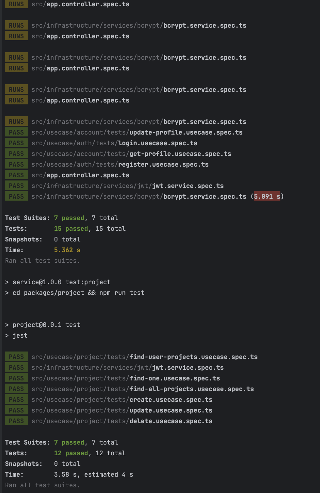

# Seenit Technical Test Documentation

## Author 🚀

> ADEBAYO EMMANUEL TOLUWANIMI

---

## Overview 📝

This submission is a technical test for the role of a software engineer at Seenit.

## Task 📋

Create the following

1. Users service which holds user data, containing at least the following

```javascript
{
        firstName,
        surname,
        email,
        avatarUrl,
        createdAt,
        updatedAt
}

```

2. Projects service which holds project data, containing at least the following

```javascript
    {
    name,
        description,
        createdBy,
        createdAt,
        updatedAt
}
```

## Acceptance Criteria

1. Users service
    1. RESTFul CRUD
    2. Ensure the email is unique and a valid format
2. Projects service
    1. RESTFul CRUD
    2. Ensure name is unique
3. Use GQL to combine or other tools to retrieve
    1. Projects with details of users who created them

Notes for the solution:

- The graphql instance can be called from any domain
- It is ok to mock the data rather than using a data store
- Consider how to generate docs for the services
- How would you ensure only allowed users can see the endpoints
- Consider using best practice for creating services

## Technologies Used 🛠

- Node.js
- Nest.js
- Docker
- GraphQL

---

## Database Used 🛠

- [Couchbase](https://www.couchbase.com/) (Couchbase)

---

## Setup 🛠

## Install NodeJS

To Install NodeJS, kindly go to [Nodejs](https://nodejs.com) and follow the necessary instructions required depending on
your PC Operating System

## MACOS

using a [package](https://nodejs.org/en/#download) simply download the installer

using [homebrew](https://github.com/Homebrew/legacy-homebrew)

```markdown
brew install node
```

---

## Windows

using a [package](https://nodejs.org/en/#download) simply download the installer

using [chocolatey](http://chocolatey.org/) to install Node

```markdown
cinst nodejs
```

---

## Clone the repository

```markdown
gh repo clone toluwaanimi/seenit-backend-techtest
```

# Domain Driven Architecture

The approach of Domain Driven Architecture (DDA) was taken in this project to ensure that the code is organized around
the business domain. This approach emphasizes the importance of understanding the business domain and modeling it in the
code.

In DDA, each module is organized around a specific domain concept. This allows for better separation of concerns and
easier maintenance of the codebase. The main benefits of this approach are:

* Clear Separation of Concerns: Each module contains the code that is relevant to a specific domain concept, making it
  easier to understand and maintain.
* Better Collaboration: When the code is organized around the business domain, it is easier for the development team and
  stakeholders to collaborate and communicate effectively.
* Flexibility: DDA allows for greater flexibility in the codebase, making it easier to adapt to changes in the business
  domain.

## Folder Structure for each service

- `src/domain/`: Contains the domain layer of the application, which is responsible for the business logic and data
  modeling.
    - `adapters/`: Contains adapters for external interfaces and services that the application interacts with.
    - `config/`: Contains configuration files for the domain layer.
    - `exceptions/`: Contains custom exceptions for the domain layer.
    - `logger/`: Contains logging setup and utilities for the domain layer.
    - `model/`: Contains the application domain models and types.
    - `repositories/`: Contains repository interfaces for the domain models.
- `src/infrastructure/`: Contains the infrastructure layer of the application, which is responsible for the
  implementation details such as data access and external API integrations.
    - `common/`: Contains shared code and utilities for the infrastructure layer.
    - `config/`: Contains configuration files for the infrastructure layer.
    - `controllers/`: Contains controllers for the HTTP endpoints.
    - `entities/`: Contains database entities for the domain models.
    - `logger/`: Contains logging setup and utilities for the infrastructure layer.
    - `repositories/`: Contains concrete implementations of the repository interfaces.
    - `services/`: Contains services for the domain logic and data access.
    - `usecase-proxy/`: Contains use case proxies for external API integrations.
- `src/usecases/`: Contains the use cases (business logic) of the application.
    - `general-usecase-proxy.module.ts/`: Contains a general use case proxy module.
    - `usecase-proxy.ts/`: Contains the class for use case proxies.
- `src/main.ts`: The entry point of the application.
- `README.md`: The readme file for the project.

## Architecture

|                | Gateway Service | Project Service |  User Service   |
|----------------|:---------------:|:---------------:|:---------------:|
| **GraphQL**    |      (API)      |      (API)      |      (API)      |
| **Auth**       |   Basic + JWT   |   Basic + JWT   |   Basic + JWT   |
| **Playground** | [Basic Auth](#) | [Basic Auth](#) | [Basic Auth](#) |

```markdown
                    +-----------------+
                    |   Gateway       |
                    |   Service       |
                    +-------^---------+
                            |
                            |
    +-----------------------+
    |                       |                      
    v                       v                      

+---------+ +---------+                 
| Project | | User |                 
| Service | | Service |                 
+---------+ +---------+

```

## Environment Variables Example

## Gateway Service

```markdown
NODE_ENV=development
JWT_SECRET=secret
JWT_EXPIRES_IN=24h
GATEWAY_PORT=3001
USER_SERVICE_URL=http://localhost:3000/graphql
PROJECT_SERVICE_URL=http://localhost:3002/graphql
```

## Project Service

```markdown
DATABASE_CONNECTION_STRING=couchbases://cb.0kjkvose6cphmwx4.cloud.couchbase.com
DATABASE_CLUSTER=user
DATABASE_CLUSTER_PASSWORD="Justseenit2024:"
DATABASE_BUCKET=seenit
DATABASE_SCOPE=seenit
NODE_ENV=development
JWT_SECRET=secret
JWT_EXPIRES_IN=24h
PROJECT_PORT=3002
```

## User Service

```markdown
DATABASE_CONNECTION_STRING=couchbases://cb.0kjkvose6cphmwx4.cloud.couchbase.com
DATABASE_CLUSTER=user
DATABASE_CLUSTER_PASSWORD="Justseenit2024:"
DATABASE_BUCKET=seenit
DATABASE_SCOPE=seenit
NODE_ENV=development
JWT_SECRET=secret
JWT_EXPIRES_IN=24h
USER_PORT=3000
```

## Install the dependencies

```markdown
npm run install:all
```

## Running the services individually

```markdown
npm run start:project
npm run start:user
npm run start:gateway
```

## Running the application at once

```markdown
npm run start-all-with-gateway-last
```

## Running the application with docker

Note: Ensure you have docker installed on your machine

```markdown
docker-compose up
```

## GraphQL Playground

### Gateway Service

```markdown
http://localhost:3001/graphql
```

### Project Service

```markdown
http://localhost:3002/graphql
```

### User Service

```markdown
http://localhost:3000/graphql
```

## Credentials for Playground Authentication

```markdown
username: admin
password: admin
```

## Ensuring only allowed users can see the endpoints

Currently, we're using basic authentication with hardcoded credentials stored in `constants.ts` to restrict access to
our playground.
To enhance this, we can transition to using a database to store and authenticate credentials dynamically.
This approach simplifies credential management and allows for more flexible access control.

## Solution 📦

### Users Service

#### Register User

```graphql
mutation{
    register(input:{
        email :"example@gmail.com",
        firstName :"John",
        surname :"David",
        password:"password",
        avatarUrl :""
    }){
        token
    }
}
```

#### Login User

```graphql
mutation {
    login(input: {
        email: "john.doe@example.com",
        password: "password123",
    }) {
        token
    }
}
```

#### Get Profile

```graphql
query{
    profile{
        id
        email
        firstName
        lastName
        email
        avatarUrl
    }
}
```

#### Get Profile By ID

```graphql
query{
    user(id :"89aa8e40-8504-4db1-b5c5-fff09965e8fa"){
        id
        email
        firstName
        lastName
        email
        avatarUrl
    }
}
``` 

#### Update Profile

```graphql
mutation{
    profile(data:{
        firstName :"Just"
    }){
        id
        email
        lastName
        firstName
        avatarUrl
        updatedAt
        createdAt
    }
}
```

### Projects Service

#### Create Project

```graphql
mutation {
    project(input: {
        name: "Sampl"
        description: "This is a sample project."
    }) {
        id
        name
        description
        createdBy
        createdAt
        updatedAt
        user {
            id
            lastName
            firstName

        }
    }
}
``` 

#### Get Projects

```graphql
query{
    projects(filter:{
        page : 1,
        limit: 10
    }){
        data {
            id
            description
            name
            user{
                id
                firstName
            }
        }
        limit
        itemCount
    }
}
```

#### Get User Projects

```graphql
query{
    userProjects(filter:{
        page : 1,
        limit: 10
    }){
        data {
            id
            description
            name
            user{
                id
                firstName
                lastName
                avatarUrl
                email
            }
        }
        limit
        itemCount
    }
}
```

#### Get Project By ID

```graphql
query{
    project(id:"3e5cb30c-b29c-4cad-b763-66352d2c28a0"){
        id
        name
        description
        createdBy
        createdAt
        updatedAt
        user {
            id
            firstName
        }
    }
}
```

#### Update Project

```graphql
mutation{
    updateProject(input:{
        id :"1a90cf76-d300-4d44-bb7c-cab139aee2a0",
        name :"Just"
    }){
        id
        description
        name
        createdAt
        updatedAt
        user{
            id
            firstName
        }
    }
}
```

#### Delete Project

```graphql
mutation{
    deleteProject(id:"1a90cf76-d300-4d44-bb7c-cab139aee2a0")
}
```

## Testing 🧪

Testing was implemented using Jest. To run the tests, use the following command:

### Users Service

```markdown
npm run test:user
```

### Projects Service

```markdown
npm run test:project
```

## All Tests

```markdown
npm run test:all
```

### Test Results




